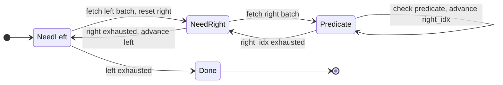

I've been working through CMU 15-445[^1], Andy Pavlo's database internals course. One of the assignments asks you to implement a **Nested Loop Join** executor in C++. The algorithm is two nested loops. My implementation was 80 lines, and most of those lines had nothing to do with joining.

Out of curiosity, I rewrote it in Python using generators. It fit in twelve lines.

This post is about what lives in that gap.

## The algorithm

`JOIN` matches rows from two tables by a predicate. In relational algebra:

$$R \bowtie S = \{ r \| s \mid r \in R,\ s \in S,\ \text{predicate}(r, s) \}$$

```sql
SELECT * FROM R
JOIN S ON R.id = S.id;
```

In code, that's two nested loops. For every row on the left, scan every row on the right and emit pairs that match:

```python
def nested_loop_join(left: list[Row], right: list[Row], predicate: Callable[[Row, Row], bool]) -> list[Row]:
    result = []

    for left_row in left:
        for right_row in right:
            if predicate(left_row, right_row):
                result.append(left_row + right_row)

    return result
```

That works beautifully in isolation. The problem is trying to fit it into a real database executor.

## The Volcano model

Real database executors can't run a query and return a list. A join between two large tables would exceed available memory before the first row reaches the caller. Instead, they use the **Volcano model**[^2]: every operator exposes a `next()` interface. The consumer pulls rows from the root; the root pulls from its children; data flows upward on demand. Nothing runs until something asks.


PostgreSQL and MySQL follow this pattern closely. You can see it in PostgreSQL's [`nodeNestloop.c:61`](https://github.com/postgres/postgres/blob/master/src/backend/executor/nodeNestloop.c#L61) (`ExecNestLoop`) and MySQL's [`composite_iterators.cc:500`](https://github.com/mysql/mysql-server/blob/trunk/sql/iterators/composite_iterators.cc#L500) (`NestedLoopIterator::DoRead`). SQLite is the outlier: it compiles queries into bytecode for a register-based VM ([`vdbe.c`](https://github.com/sqlite/sqlite/blob/master/src/vdbe.c)) rather than building a tree of iterator nodes.

In practice, `next()` takes a `batch_size` argument rather than returning one row at a time. Batching handles two things:

1. **Memory**: only `batch_size` rows from each side live in memory at once. Two tables with a million rows each means up to a trillion predicate evaluations if materialized upfront; batching keeps that from blowing up.
2. **Throughput**: a tight inner loop over a contiguous buffer is cache-friendly in a way that row-at-a-time processing is not.

The contract becomes: *give me N result rows, then stop. I'll ask again when I want more.*

## The state machine you have to write

Here is where it gets messy. When `next(batch_size)` returns a full batch, both loops are mid-flight. The outer loop is on `left[i]`. The inner loop is on `right[j]`. The next call has to resume from exactly that point.

The simple algorithm has no concept of resumption. It runs to completion. To satisfy the batched pull interface, you have to externalize the entire loop state into the object:

```python
class Executor(Protocol):
    def reset(self) -> None: ...
    def next(self, batch_size: int) -> list[Row]: ...
    def has_next(self) -> bool: ...

class NestedLoopJoin:
    def __init__(self, left_exec: Executor, right_exec: Executor, predicate: Callable[[Row, Row], bool]):
        self.left_exec  = left_exec
        self.right_exec = right_exec
        self.predicate  = predicate

        # manually-tracked loop state
        self.left_buf   = []
        self.right_buf  = []
        self.left_idx   = 0
        self.right_idx  = 0

    def next(self, batch_size: int) -> list[Row]:
        batch = []

        while len(batch) < batch_size:
            # Left buffer exhausted
            if self.left_idx == len(self.left_buf):
                if not self.left_exec.has_next():
                    break
                self.left_buf = self.left_exec.next(batch_size)
                self.left_idx = 0
                self.right_exec.reset()
                self.right_buf = self.right_exec.next(batch_size)
                self.right_idx = 0
                continue

            # Right buffer exhausted
            if self.right_idx == len(self.right_buf):
                if not self.right_exec.has_next():
                    self.left_idx += 1
                    self.right_exec.reset()
                self.right_buf = self.right_exec.next(batch_size)
                self.right_idx = 0
                continue

            left_row  = self.left_buf[self.left_idx]
            right_row = self.right_buf[self.right_idx]
            if self.predicate(left_row, right_row):
                batch.append(left_row + right_row)
            self.right_idx += 1

        return batch
```

On a concrete input:

```python
# left  = [(1, 'a'), (2, 'b')]
# right = [(10, 'a'), (20, 'b')]
# predicate: columns at index 1 must match

executor.next(10)
# → [(1, 'a', 10, 'a'), (2, 'b', 20, 'b')]
```

The `while` loop is a state machine with three states:



Every field on `self` exists to remember which state the machine was in when the last `next()` returned. The actual join logic (checking the predicate and appending to the batch) is four lines at the bottom. Everything else is bookkeeping.

The two nested `for` loops are gone. The algorithm is no longer visible in the code.

## Generators

Python generators are coroutines: functions that can pause at a `yield`, return a value to the caller, and resume from the same point on the next call with all local variables intact.

A quick example before applying this to the join. Here is a subroutine that returns Fibonacci numbers:

```python
def fibonacci(num: int) -> list[int]:
    result = []
    a, b = 0, 1
    while len(result) < num:
        result.append(a)
        a, b = b, a + b
    return result

fibonacci(10)
# → [0, 1, 1, 2, 3, 5, 8, 13, 21, 34]
```

As a generator, the same logic becomes:

```python
def fibonacci() -> Iterator[int]:
    a, b = 0, 1
    while True:
        yield a
        a, b = b, a + b

list(itertools.islice(fibonacci(), 10))
# → [0, 1, 1, 2, 3, 5, 8, 13, 21, 34]
```

`a` and `b` are preserved across calls automatically. No external state, no index fields, no bookkeeping.

Applied to nested loop join:

```python
def nested_loop_join(
    left_source: Callable[[], Iterator[list[Row]]],
    right_source: Callable[[], Iterator[list[Row]]],
    predicate: Callable[[Row, Row], bool],
    batch_size: int
) -> Iterator[list[Row]]:
    batch = []

    for left_batch in left_source():
        for left_row in left_batch:
            for right_batch in right_source():
                for right_row in right_batch:
                    if predicate(left_row, right_row):
                        batch.append(left_row + right_row)
                        if len(batch) == batch_size:
                            yield batch
                            batch = []
    if batch:
        yield batch
```

With the same input, it runs exactly the same way:

```python
def left_source():
    yield [(1, 'a'), (2, 'b')]

def right_source():
    yield [(10, 'a'), (20, 'b')]

joiner = nested_loop_join(left_source, right_source, lambda l, r: l[1] == r[1], batch_size=10)

next(joiner)
# → [(1, 'a', 10, 'a'), (2, 'b', 20, 'b')]
```

The two nested `for` loops are back. The algorithm is visible again.

The translation from the stateful class to the generator is 1:1:

| Class field | Generator equivalent |
|---|---|
| `left_idx`, `left_buf` | `left_row`, `left_batch` (held in suspended frame) |
| `right_idx`, `right_buf` | `right_row`, `right_batch` (held in suspended frame) |
| `has_next()` check | `StopIteration` raised naturally by the `for` loops |
| `right_exec.reset()` | `right_source()` called on each outer iteration |

`right_source` must be a callable, not a bare iterator. A bare iterator exhausts on the first left row; every subsequent left row would join against nothing. The callable forces a fresh scan per outer iteration, which is exactly what `right_exec.reset()` was doing in the stateful class.

## What this shows

The stateful class is a coroutine written by hand. `left_idx`, `right_idx`, `left_buf`, `right_buf` are the suspended call frame. `next()` is resume. The `while` loop with its three zones is the dispatch table.

Coroutines are almost always pitched as a concurrency concept: suspend execution, go do other work, and resume when the network I/O finishes. But that's only half the story. At its core, a coroutine is a function that can be paused and resumed without losing its local state. Concurrency is one application. Incremental computation over data is another.

Any algorithm that is inherently a loop but needs to yield results incrementally is a coroutine. Nested loop join is one example. The merge step in merge sort is another. Tree traversal with an external iterator is another.

When you find yourself adding `idx` and `buf` fields to a class so a method can resume mid-computation, you are writing a coroutine by hand. Python's `yield` does not just make it shorter. It lets the code say what the algorithm does, rather than how to resume it.

## The same idea in other languages

Python is not unique here. Most modern languages have some form of this, though they differ in what the runtime actually does with it.

**Kotlin** has `sequence { }`, a coroutine builder for lazy sequences:

```kotlin
fun nestedLoopJoin(
    left: Sequence<Row>,
    rightSource: () -> Sequence<Row>,
    predicate: (Row, Row) -> Boolean
): Sequence<Row> = sequence {
    for (leftRow in left) {
        for (rightRow in rightSource()) {
            if (predicate(leftRow, rightRow)) {
                yield(leftRow + rightRow)
            }
        }
    }
}
```

The structure matches the Python version. The difference is under the hood: the Kotlin compiler transforms this into a state machine class which stores stack variables in the heap along with a `resumeWith` dispatch method.

**TypeScript** has generator functions (`function*`) with `yield`, same semantics as Python:

```typescript
type Row = readonly unknown[];

function* nestedLoopJoin(
    left: Iterable<Row>,
    rightSource: () => Iterable<Row>,
    predicate: (left: Row, right: Row) => boolean
): Generator<Row> {
    for (const leftRow of left) {
        for (const rightRow of rightSource()) {
            if (predicate(leftRow, rightRow)) {
                yield [...leftRow, ...rightRow];
            }
        }
    }
}
```

**Go** traditionally solved this by coupling a goroutine with a channel, but as of Go 1.23, it has standard function iterators[^3] that act like generators:

```go
import "iter"

func nestedLoopJoin(left iter.Seq[Row], rightSource func() iter.Seq[Row], predicate func(Row, Row) bool) iter.Seq[Row] {
    return func(yield func(Row) bool) {
        for leftRow := range left {
            for rightRow := range rightSource() {
                if predicate(leftRow, rightRow) {
                    if !yield(append(leftRow, rightRow...)) {
                        return
                    }
                }
            }
        }
    }
}
```

The core pattern stays the same: write the algorithm as a loop, suspend with `yield`, and let the runtime remember where you are. The languages differ in how they implement the suspension (state machines in Python, Kotlin, and JS; goroutine-based in Go) and how much the compiler does for you.

## Limitations

Generators fit the row-at-a-time Volcano model well. Columnar engines like DuckDB and Apache Arrow DataFusion process data in column-oriented batches and bypass per-row iteration for throughput reasons. In those systems the state management is real, but it lives at the compiled query level rather than in interpreter-visible objects.

Production databases like PostgreSQL and MySQL also aren't going to rewrite their executors to use generators any time soon. The hand-written state machine in `nodeNestloop.c` has been tested, profiled, and debugged over decades. You could theoretically swap it out for a generator and get the same behavior, but regressions in a database executor are painful to debug. The existing code probably handles a dozen obscure edge cases that nobody documented. Battle-tested code usually wins out.

For writing new query engines or any iterator model, however, generators are entirely the right way to do it.

[^1]: [CMU 15-445: Database Systems, Fall 2025](https://15445.courses.cs.cmu.edu/fall2025/)
[^2]: Graefe, G. (1994). *Volcano: An Extensible and Parallel Query Evaluation System*. IEEE Transactions on Knowledge and Data Engineering, 6(1), 120-135. https://cs-people.bu.edu/mathan/reading-groups/papers-classics/volcano.pdf
[^3]: Go 1.23 release notes: [Range over function iterators](https://go.dev/blog/range-functions)
