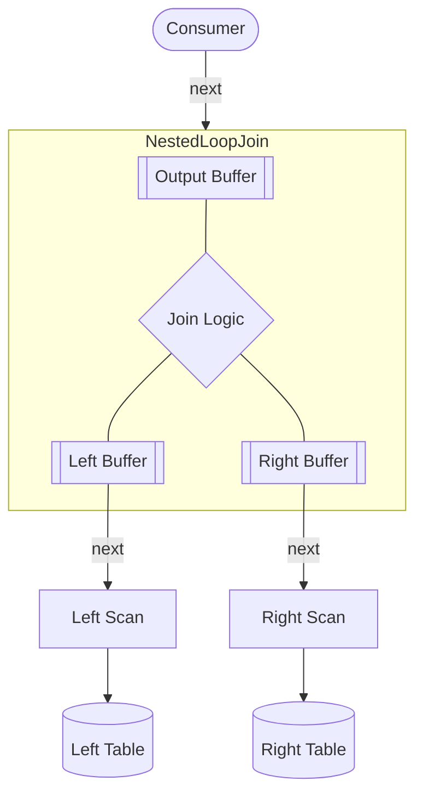
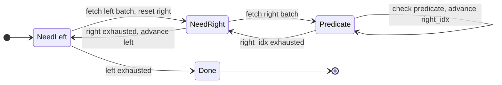

I've been working through CMU 15-445[^1], Andy Pavlo's database internals course. One of the assignments asks you to implement a **Nested Loop Join** executor in C++. The algorithm is two nested loops. My implementation was 80 lines, and most of those lines had nothing to do with joining.

Out of curiosity, I rewrote it in Python using generators. It fit in twelve lines.

The gap is a hand-written state machine. It exists because the C++17 used in the course cannot pause a function mid-execution and resume it later. Python can.[^5]

This post covers one join algorithm (nested loop join) and one language primitive (generators). It does not cover hash joins, sort-merge joins, or async/await.

## The algorithm

`JOIN` matches rows from two tables by a predicate. In relational algebra:

$$R \bowtie S = \{ r \| s \mid r \in R,\ s \in S,\ \text{predicate}(r, s) \}$$

```sql
SELECT * FROM R
JOIN S ON R.id = S.id;
```

For every row on the left, scan every row on the right and emit pairs that match:

```python
def nested_loop_join(left: list[Row], right: list[Row], predicate: Callable[[Row, Row], bool]) -> list[Row]:
    result = []

    for left_row in left:
        for right_row in right:
            if predicate(left_row, right_row):
                result.append(left_row + right_row)

    return result
```

That works in isolation. The problem is fitting it into a real database executor.

## The Volcano model

Real database executors can't run a query and return a list. A join between two large tables would exceed available memory before the first row reaches the caller. Instead, they use the **Volcano model**[^2]: every operator exposes a `next()` interface. The consumer pulls rows from the root; the root pulls from its children; data flows upward on demand. Nothing runs until something asks.



PostgreSQL and MySQL follow this pattern closely. You can see it in PostgreSQL's [`nodeNestloop.c:61`](https://github.com/postgres/postgres/blob/master/src/backend/executor/nodeNestloop.c#L61) (`ExecNestLoop`) and MySQL's [`composite_iterators.cc:500`](https://github.com/mysql/mysql-server/blob/trunk/sql/iterators/composite_iterators.cc#L500) (`NestedLoopIterator::DoRead`). SQLite is the outlier: it compiles queries into bytecode for a register-based VM ([`vdbe.c`](https://github.com/sqlite/sqlite/blob/master/src/vdbe.c)) rather than building a tree of iterator nodes.

The classic Volcano interface returns one row per call. PostgreSQL's `ExecNestLoop` and MySQL's `NestedLoopIterator::DoRead` both work this way. For this post, I use a batched variant that returns N rows at a time, because it makes the state machine problem more visible. Batching also has practical motivation:

1. **Memory**: only `batch_size` rows from each side live in memory at once. Two tables with a million rows each means up to a trillion predicate evaluations if materialized upfront; batching keeps that from blowing up.
2. **Throughput**: a tight inner loop over a contiguous buffer is cache-friendly in a way that row-at-a-time processing is not.

The contract becomes: *give me N result rows, then stop. I'll ask again when I want more.*

## The state machine you have to write

When `next(batch_size)` returns a full batch, both loops are mid-flight. The outer loop is on `left[i]`. The inner loop is on `right[j]`. The next call has to resume from exactly that point.

The simple algorithm has no concept of resumption. It runs to completion. To satisfy the batched pull interface, you have to externalize the entire loop state into the object:

```python
class Executor(Protocol):
    def reset(self) -> None: ...
    def next(self, batch_size: int) -> list[Row]: ...
    def has_next(self) -> bool: ...

class NestedLoopJoin:
    def __init__(self, left_exec: Executor, right_exec: Executor, predicate: Callable[[Row, Row], bool]):
        self.left_exec  = left_exec
        self.right_exec = right_exec
        self.predicate  = predicate

        # manually-tracked loop state
        self.left_buf   = []
        self.right_buf  = []
        self.left_idx   = 0
        self.right_idx  = 0

    def next(self, batch_size: int) -> list[Row]:
        batch = []

        while len(batch) < batch_size:
            # Left buffer exhausted
            if self.left_idx == len(self.left_buf):
                if not self.left_exec.has_next():
                    break
                self.left_buf = self.left_exec.next(batch_size)
                self.left_idx = 0
                self.right_exec.reset()
                self.right_buf = self.right_exec.next(batch_size)
                self.right_idx = 0
                continue

            # Right buffer exhausted
            if self.right_idx == len(self.right_buf):
                if not self.right_exec.has_next():
                    self.left_idx += 1
                    self.right_exec.reset()
                self.right_buf = self.right_exec.next(batch_size)
                self.right_idx = 0
                continue

            left_row  = self.left_buf[self.left_idx]
            right_row = self.right_buf[self.right_idx]
            if self.predicate(left_row, right_row):
                batch.append(left_row + right_row)
            self.right_idx += 1

        return batch
```

On a concrete input:

```python
# left  = [(1, 'a'), (2, 'b')]
# right = [(10, 'a'), (20, 'b')]
# predicate: columns at index 1 must match

executor.next(10)
# → [(1, 'a', 10, 'a'), (2, 'b', 20, 'b')]
```

The `while` loop is a state machine with three states:



Every field on `self` exists to remember which state the machine was in when the last `next()` returned. The actual join logic (checking the predicate and appending to the batch) is four lines at the bottom. Everything else is bookkeeping.

The two nested `for` loops are gone. The algorithm is no longer visible in the code.

## Generators

Python generators are coroutines: functions that can pause at a `yield`, return a value to the caller, and resume from the same point on the next call with all local variables intact[^4].

Applied to nested loop join:

```python
def nested_loop_join(
    left_source: Callable[[], Iterator[list[Row]]],
    right_source: Callable[[], Iterator[list[Row]]],
    predicate: Callable[[Row, Row], bool],
    batch_size: int
) -> Iterator[list[Row]]:
    batch = []

    for left_batch in left_source():
        for left_row in left_batch:
            for right_batch in right_source():
                for right_row in right_batch:
                    if predicate(left_row, right_row):
                        batch.append(left_row + right_row)
                        if len(batch) == batch_size:
                            yield batch
                            batch = []
    if batch:
        yield batch
```

With the same input, it runs exactly the same way:

```python
def left_source():
    yield [(1, 'a'), (2, 'b')]

def right_source():
    yield [(10, 'a'), (20, 'b')]

joiner = nested_loop_join(left_source, right_source, lambda l, r: l[1] == r[1], batch_size=10)

next(joiner)
# → [(1, 'a', 10, 'a'), (2, 'b', 20, 'b')]
```

The two nested `for` loops are back. The algorithm is visible again.

The translation from the stateful class to the generator is 1:1:

| Class field | Generator equivalent |
|---|---|
| `left_idx`, `left_buf` | `left_row`, `left_batch` (held in suspended frame) |
| `right_idx`, `right_buf` | `right_row`, `right_batch` (held in suspended frame) |
| `has_next()` check | `StopIteration` raised naturally by the `for` loops |
| `right_exec.reset()` | `right_source()` called on each outer iteration |

`right_source` must be a callable, not a bare iterator. A bare iterator exhausts on the first left row; every subsequent left row would join against nothing. The callable forces a fresh scan per outer iteration, which is exactly what `right_exec.reset()` was doing in the stateful class.

The stateful class from earlier is a coroutine written by hand. `left_idx`, `right_idx`, `left_buf`, `right_buf` are the suspended call frame. `next()` is resume. The `while` loop with its three zones is the dispatch table.

Coroutines are almost always pitched as a concurrency concept. At their core, they are functions that can be paused and resumed without losing local state. Concurrency is one use. Incremental computation over data is another, and it is the one that matters here.

Any algorithm that is inherently a loop but needs to yield results incrementally is a coroutine. Nested loop join is one example. The merge step in merge sort is another. Tree traversal with an external iterator is another. When you find yourself adding `idx` and `buf` fields to a class so a method can resume mid-computation, you are writing a coroutine by hand.

## The same idea in other languages

The suspension mechanism differs across languages. Python suspends the generator frame on the heap. Kotlin's compiler transforms coroutines into state machine classes via CPS transform. Go 1.23 added runtime coroutine support for function iterators[^3]. TypeScript has `function*` with the same semantics as Python.

**Kotlin**'s `sequence { }` is a coroutine builder for lazy sequences. The Kotlin compiler applies a CPS (continuation-passing style) transform, then flattens the nested continuations into a single state machine class with a label field for dispatch and stack variables stored on the heap.

```kotlin
fun nestedLoopJoin(
    left: Sequence<Row>,
    rightSource: () -> Sequence<Row>,
    predicate: (Row, Row) -> Boolean
): Sequence<Row> = sequence {
    for (leftRow in left) {
        for (rightRow in rightSource()) {
            if (predicate(leftRow, rightRow)) {
                yield(leftRow + rightRow)
            }
        }
    }
}
```

**Go** is the more interesting case. The `iter.Seq` API is callback-shaped: instead of `yield` being a keyword, the caller passes a `yield` function that the iterator invokes. If the consumer is done, `yield` returns `false`. But the implementation is not purely callback-based. Go 1.23 added coroutine support to the runtime (`runtime.newcoro` / `coroswitch`), which performs actual goroutine stack switching when the iterator yields. The API hides the suspension; the runtime still does it.

```go
import "iter"

func nestedLoopJoin(left iter.Seq[Row], rightSource func() iter.Seq[Row], predicate func(Row, Row) bool) iter.Seq[Row] {
    return func(yield func(Row) bool) {
        for leftRow := range left {
            for rightRow := range rightSource() {
                if predicate(leftRow, rightRow) {
                    if !yield(append(leftRow, rightRow...)) {
                        return
                    }
                }
            }
        }
    }
}
```

## Limitations

I have not benchmarked the generator version against the stateful class. In Python, generator frame suspension has real overhead per yield. For a join executor doing millions of predicate evaluations, that overhead is measurable. Whether it matters depends on whether the bottleneck is the join logic or the I/O underneath it.

Generators fit the row-at-a-time Volcano model well. Columnar engines like DuckDB and Apache Arrow DataFusion process data in column-oriented batches and bypass per-row iteration entirely for throughput reasons. In those systems the state management is real, but it lives at the compiled query level rather than in interpreter-visible objects.

Production databases like PostgreSQL and MySQL are not going to rewrite their executors to use generators. The hand-written state machine in `nodeNestloop.c` has been tested, profiled, and debugged over decades. It probably handles a dozen obscure edge cases that nobody documented. Battle-tested code wins.

When a language can suspend and resume a function, the algorithm stays visible in the code. When it cannot, you bury the algorithm in bookkeeping. That is the real cost of missing coroutine support: not performance, but legibility.

[^1]: [CMU 15-445: Database Systems, Fall 2025](https://15445.courses.cs.cmu.edu/fall2025/)
[^2]: Graefe, G. (1994). *Volcano: An Extensible and Parallel Query Evaluation System*. IEEE Transactions on Knowledge and Data Engineering, 6(1), 120-135. https://cs-people.bu.edu/mathan/reading-groups/papers-classics/volcano.pdf
[^3]: Go 1.23 release notes: [Range over function iterators](https://go.dev/blog/range-functions)
[^4]: A minimal example: a Fibonacci subroutine `def fibonacci(n)` that builds a list and returns it becomes `def fibonacci()` with `yield a` inside a `while True` loop. `a` and `b` are preserved across calls automatically. No external state, no index fields, no bookkeeping.
[^5]: C++20 added coroutines with `co_yield` and `co_await`. C++23 added `std::generator`. BusTub uses C++17, which predates both.
